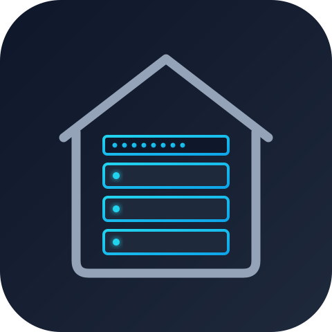
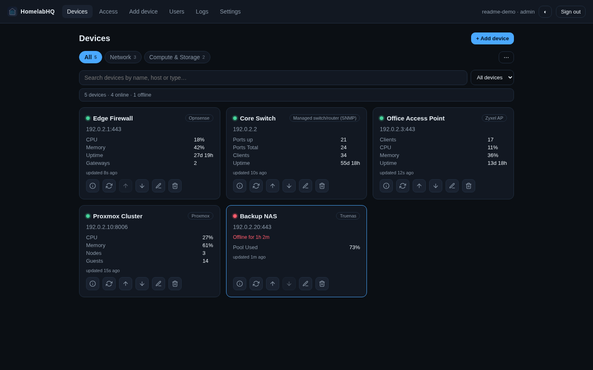

<p align="center">
  
</p>

<h1 align="center">HomelabHQ</h1>

<p align="center">
  A self-hosted, multi-user dashboard for the routers, switches, access points,
  firewalls, servers, and storage devices that run your homelab.
</p>

<p align="center">
  <a href="https://github.com/scow92/HomeLabHQ/actions/workflows/verify.yml"></a>
  <a href="LICENSE"></a>
  
</p>

HomelabHQ connects to devices over HTTP, REST APIs, SSH, or SNMP, identifies
them using a curated driver library, and presents their useful health data in
one installable web app. It provides live device cards, history charts,
driver-specific detail tables, network-client visibility, and optional device
controls.

No HomelabHQ cloud account is required and the application sends no analytics
or telemetry. Device integrations contact only the endpoints you configure;
optional web-push notifications also contact the browser's push provider.



## Features

- **Guided device detection** ranks compatible drivers and helps select the
  sensors and controls to expose.
- **17 built-in drivers across four transports** cover common firewalls,
  routers, switches, access points, hypervisors, and NAS platforms.
- **Live dashboards** provide device status, sensor values, search, grouping,
  drag-and-drop ordering, and on-demand synchronization.
- **Rich device detail** includes history and throughput charts plus interfaces,
  switch ports, radios, clients, learned MAC addresses, and gateways where the
  driver supports them.
- **Assisted WireGuard endpoint management for OPNsense** discovers NordVPN
  candidates, classifies public network ownership, monitors authenticated
  handshakes, and applies a confirmed replacement with rollback.
- **Network Access roster** discovers clients from an owner's devices and
  provides filtering, history, export, notifications, editing, AP bindings,
  and supported firewall/NAC controls.
- **Installable PWA with web push** can notify users about device availability
  transitions and newly discovered clients.
- **Multi-user isolation** keeps devices, dashboards, client rosters, and
  subscriptions scoped to their owner while giving administrators explicit
  management visibility.
- **Single-service operation** uses a versioned JSON document store with
  separate bounded history files; no database or message broker is required.

## Integration status

The status below is deliberately conservative. **Confirmed** means repository
history records validation against a live system. **Proven port** means the
driver was adapted from an existing real-device integration. **Basic template**
means its documented API mapping and authentication are covered by local mock
servers, but real-hardware compatibility has not yet been recorded.

| Device or platform | Transport | Authentication | Validation status |
|---|---|---|---|
| OPNsense | REST API | API key and secret | **Confirmed** against a live system |
| TrueNAS SCALE | REST API | Bearer API key | **Confirmed** on 25.10 (DXP4800 Plus) |
| Keeplink web-smart switches | HTTP | Username and password | **Proven port** from an existing real-device integration |
| Zyxel NWA/WAX access points | HTTP | Username and password | **Proven port** from an existing real-device integration |
| pfSense REST API v2 | REST API | `X-API-Key` header | Basic template; mock-tested only |
| UniFi Network 9+ | REST API | Integration API key | Basic template; mock-tested only |
| Proxmox VE | REST API + SSH for updates | API token; optional root SSH credential | Basic template; mock-tested only |
| Firewalla MSP | REST API | MSP token | Basic template; mock-tested only |
| MikroTik RouterOS | REST API | Username and password | Basic template; mock-tested only |
| OpenWrt | HTTP | ubus username and password | Basic template; mock-tested only |
| Synology DSM | HTTP | Username and password | Basic template; mock-tested only |
| QNAP QTS | HTTP | Username and password | Basic template; mock-tested only |

Generic fallbacks support Linux/Unix hosts over SSH, SNMP devices, managed
switches and routers using SNMP IF-MIB, REST APIs, and HTTP web interfaces.

Template mappings are starting points rather than confirmed compatibility
claims. Firmware can differ, so real-hardware reports should include the model
and firmware version. Contributions that promote a template to confirmed
compatibility are especially welcome.

### OPNsense VPN endpoint API requirements

The optional VPN Endpoint Manager uses OPNsense's WireGuard MVC API. Its API
key user needs the **VPN: WireGuard: Configuration** and **Status: Services**
privileges. If a manager profile also names a gateway UUID, that user
additionally needs access to the routing gateway settings API. HomeLabHQ makes
these calls:

| Method | OPNsense path | Purpose |
|---|---|---|
| `GET` | `/api/wireguard/client/searchClient` | List selectable peers |
| `GET` | `/api/wireguard/server/searchServer` | List selectable instances |
| `GET` | `/api/wireguard/client/getClient/{uuid}` | Snapshot the complete peer for update and rollback |
| `POST` | `/api/wireguard/client/setClient/{uuid}` | Save the peer under a top-level `client` object |
| `GET` | `/api/wireguard/service/show` | Read authenticated handshake status |
| `POST` | `/api/wireguard/service/reconfigure` | Regenerate WireGuard configuration from the saved model |
| `POST` | `/api/core/service/restart/wireguard/{instanceUuid}` | Restart the selected WireGuard instance so the saved endpoint becomes active |

The `setClient` body is `{"client": { ... }}`; it is not a flat peer object.
OPNsense expands the `tunneladdress` and `servers` values in `getClient`
responses for its UI, but `setClient` requires those two values as
comma-separated strings. HomeLabHQ normalises that response and sends only the
documented writable client fields. This follows the contract illustrated in
the [OPNsense WireGuard API discussion](https://forum.opnsense.org/index.php?topic=30367.0).
An HTTP 403 during these calls indicates missing OPNsense privileges rather
than a failed WireGuard handshake.

See [WireGuard VPN Endpoint Manager](docs/vpn-endpoints.md) for profile setup,
external lookups, rollback behaviour, limitations, and manual recovery.

## Quick start

You need Git, Docker Engine, and Docker Compose v2.

```bash
git clone https://github.com/scow92/HomeLabHQ.git
cd HomeLabHQ
docker compose up -d --build
```

Open <https://localhost:8770> and create the first administrator account. The
Compose deployment enables built-in TLS and stores application data in the
`hlhq-data` named volume. The first certificate is self-signed, so the browser
will warn until it is trusted.

To include the LAN names or addresses used by other devices in that
certificate, copy `.env.example` to `.env` and set `HLHQ_TLS_HOSTS` before the
first start:

```bash
cp .env.example .env
# Edit .env, for example: HLHQ_TLS_HOSTS=192.168.1.10,homelabhq.lan
```

Keep `.env` local to the deployment; Git ignores it. If the certificate already
exists, back up the complete data directory, stop HomelabHQ, and remove only
`<data-dir>/secrets/tls_cert.pem` and `tls_key.pem` before restarting so it can
create a replacement.

For a locally trusted certificate, install
[mkcert](https://github.com/FiloSottile/mkcert) and run:

```bash
./scripts/setup-mkcert.sh 192.168.1.10 homelabhq.lan
```

The helper writes `certs/nm.crt` and `certs/nm.key` and explains how to trust
its local CA on other devices. Uncomment the read-only `certs` mount in
`docker-compose.yml`, then recreate the service.

See [Configuration](docs/configuration.md) for every environment variable and
local development instructions. See [Operations](docs/operations.md) before
upgrading, changing storage, placing HomelabHQ behind a reverse proxy, or
restoring a backup.

## Security model

- Account passwords are scrypt-hashed and new passwords must contain at least
  15 characters.
- Device credentials are Fernet-encrypted with per-instance key material stored
  under `<data-dir>/secrets/`.
- Proxmox package discovery and installation are available from device detail;
  installs run sequentially over pinned root SSH, report per-node progress, and
  never reboot nodes automatically.
- The supplied container runs as unprivileged UID/GID `10001`, drops Linux
  capabilities, and uses a read-only root filesystem.
- Sessions use HttpOnly cookies and are marked `Secure` for built-in HTTPS and
  correctly configured reverse-proxy HTTPS.
- Responses set browser hardening headers that prevent MIME sniffing, suppress
  referrer disclosure, restrict sensitive browser capabilities, and deny
  cross-origin framing.
- Credentials, cookies, authorization headers, API keys, and common
  secret-shaped values are redacted from structured logs.
- Local development does not provide the container's process-isolation
  boundary. HomelabHQ therefore refuses to open a local data directory that
  already contains device credentials unless an explicit unsafe-development
  override is supplied.

Web push requires HTTPS or `localhost`. A trusted certificate gives the most
reliable PWA and push experience across desktop and mobile browsers.

## Documentation

- [Configuration](docs/configuration.md) — TLS, polling, retention, limits, and
  local development
- [Operations](docs/operations.md) — health checks, logs, upgrades, backups,
  reverse proxies, and capacity boundaries
- [Architecture](docs/architecture.md) — components, persistence, drivers, and
  deferred-change triggers
- [Security boundaries](docs/security.md) — deployment trust, device egress,
  and deliberate compatibility choices
- [API reference](docs/api.md) — route catalogue and authentication policies
- [Verification](docs/verification.md) — complete local and CI-equivalent checks
- [Contributing](CONTRIBUTING.md) — development workflow and driver submissions

## Contributing

New integrations and real-firmware compatibility fixes are welcome. Read
[CONTRIBUTING.md](CONTRIBUTING.md), add tests for changed behaviour, and run
`./scripts/verify.sh` before opening a pull request. Never commit real hosts,
credentials, certificates, or populated data directories.

## License

[MIT](LICENSE) © scow92
